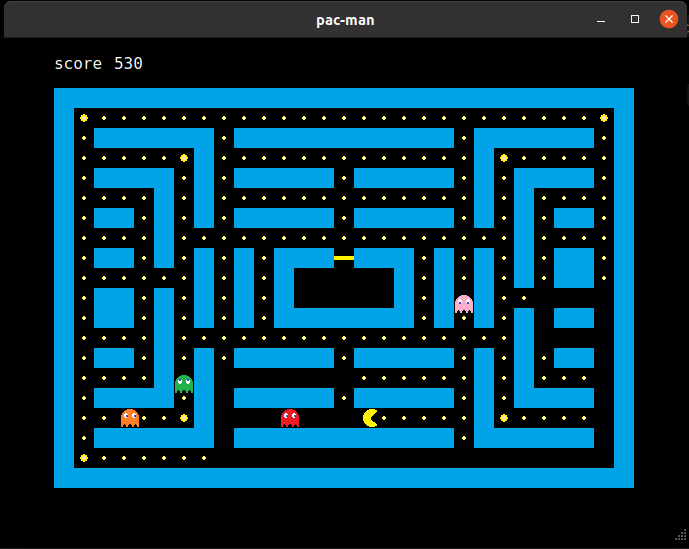

# Qt pacman

A pacman game made with Qt Creator.  

Play with w, a, s, d keys.



## Qt spec

This is developed on Qt 6.2.1. If you want to develop under Qt 6, you may need to uncomment some lines in `Qt-pac-man.pro` file.

**Name:** Qt 6.2.1 GCC 64bit  
**ABI:** x86-linux-generic-elf-64bit  
**Source:** /opt/Qt/6.2.1/gcc_64  
**mkspec:** linux-g++  

## How to call pacman game API

You can take reference from [mainwindow.cpp](https://github.com/blueskyson/Qt-pac-man/blob/master/source/mainwindow.cpp) and [mainwindow.h](https://github.com/blueskyson/Qt-pac-man/blob/master/source/mainwindow.h) for detailed code. Assume that the following steps are implemented in a `QMainWindow`.

### Step 1: declare objects and functions  
- Add a `QGraphicsView` named `graphicsView` for displaying game. (In the source code, `graphicsView` is defined in [mainwindow.ui](https://github.com/blueskyson/Qt-pac-man/blob/master/mainwindow.ui).)  
- Add a `QLabel` named `score` for displaying score.  
- Add two `QLabel`s named `win_label` and `lose_label` for displaying when game is over.  
- Add a `QTimer` named `score_timer` for updating current score.  
- Declare `keyPressEvent` override function.  
- Declare `update_score` slot function.  
- Include [game.h](https://github.com/blueskyson/Qt-pac-man/blob/master/source/game.h).

```cpp
#include <QMainWindow>
#include <QLabel>
#include <QKeyEvent>
#include <QTimer>
#include "game.h"

QT_BEGIN_NAMESPACE
namespace Ui { class MainWindow; }
QT_END_NAMESPACE

class MainWindow : public QMainWindow
{
    Q_OBJECT

public:
    MainWindow(QWidget *parent = nullptr);
    ~MainWindow();
    void keyPressEvent(QKeyEvent*) override;

private slots:
    void update_score();

private:
    Ui::MainWindow *ui;
    QLabel *score, *win_label, *lose_label;
    QTimer *score_timer;
    Game *game;
};
```

### Step 2: initialize objects

Setup `graphicsView` in the constructor of `MainWindow`.

```cpp
#include "mainwindow.h"
#include "ui_mainwindow.h"

MainWindow::MainWindow(QWidget *parent)
    : QMainWindow(parent)
    , ui(new Ui::MainWindow)
{
    ui->graphicsView->setStyleSheet("QGraphicsView {border: none;}");
    ui->graphicsView->setBackgroundBrush(Qt::black);
    ui->graphicsView->setFocusPolicy(Qt::NoFocus);
```

Set the geometry of `graphicsView` and `game`. Read game map from [map.txt](https://github.com/blueskyson/Qt-pac-man/blob/master/game_objects/map_objects/map.txt).

```cpp
    int map_height = 20, map_width = 29;            // 20x29 game map
    int x = 50, y = 50;                             // coordinate in mainwindow
    int w = (map_width * GameObject::Width);        // width pixel
    int h = (map_height * GameObject::Width);       // height pixel
    ui->graphicsView->setGeometry(x, y, w, h);
    game = new Game(x, y, map_width, map_height, ":/game_objects/map_objects/map.txt");
    ui->graphicsView->setScene(game);
```

Initialize labels and the timer.

```cpp
    score = new QLabel(this);
    win_label = new QLabel(this);
    lose_label = new QLabel(this);
    score_timer = new QTimer(this);
    // setup labels' properties here...
```

Start timer and game.

```cpp
    score_timer->start(25);
    connect(score_timer, SIGNAL(timeout()), this , SLOT(update_score()));
    game->start();
}
```

### Step 3: Implement update_score and keyPressEvent

Update score when `score_timer` ticks. If the pacman eats all points, `game->stat` will change to `Game::Win`. If a ghost catches the pacman, `game->stat` will change to `Game::Lose`. Stop timer and show `win_label` or `lose_label` when game is over.

```cpp
void MainWindow::update_score()
{
    score->setText(QString::number(game->get_score()));
    if (game->stat == Game::Win) {
        win_label->show();
        score_timer->stop();
    } else if (game->stat == Game::Lose) {
        lose_label->show();
        score_timer->stop();
    }
}
```

Detect key press events from w, a, s, d keys and make pacman move.

```cpp
void MainWindow::keyPressEvent(QKeyEvent *e)
{
    switch (e->key()) {
    case Qt::Key_W:
        game->pacman_next_direction(GameObject::Up);
        break;
    case Qt::Key_A:
        game->pacman_next_direction(GameObject::Left);
        break;
    case Qt::Key_S:
        game->pacman_next_direction(GameObject::Down);
        break;
    case Qt::Key_D:
        game->pacman_next_direction(GameObject::Right);
        break;
    }
}
```

## Changeable game parameters

Here are some changeable macro in [game.h](https://github.com/blueskyson/Qt-pac-man/blob/master/source/game.h).

```cpp
#define BALL_SCORE       10     // score of balls
#define POWERBALL_SCORE  30     // score of powerballs
#define GHOST_SCORE      50     // score of ghosts
#define INTERVAL         10     // move interval of pacman
#define NORMAL_INTERVAL  10     // move interval of normal ghosts
#define PANNIC_INTERVAL  15     // move interval of pannic ghosts
#define RUNNING_INTERVAL 5      // move interval of running ghosts
#define PANNIC_TIME      1000   // interval number of pannic ghosts
#define FLASH_INTERVAL   200    // flash interval of powerballs
```

Here's a changeable array in [game.cpp](https://github.com/blueskyson/Qt-pac-man/blob/master/source/game.cpp).

```cpp
// interval number before ghosts going out the cage
int GHOST_RELEASE_TIME[] = {0, 200, 400, 600};
```
